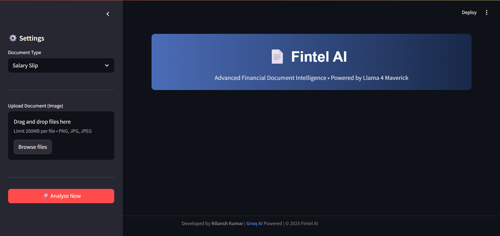
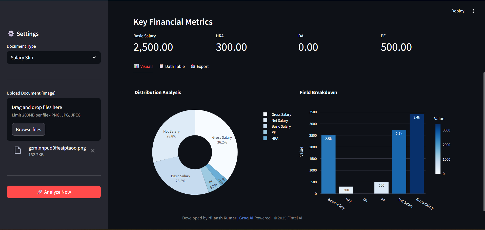

# 📄 Financial Document OCR Pipeline

An **end-to-end OCR system** designed to extract and structure information from **financial documents** such as invoices and reports using **LLM-based OCR (Llama-OCR)**, custom rule-based parsing, and an interactive **Streamlit UI**.

---

## 🔍 Overview

Processing financial documents manually is slow, error-prone, and not scalable.  
This project automates the extraction of text from scanned or image-based financial documents and converts unstructured OCR output into **structured, business-ready data**.

The system focuses not just on text recognition, but on **making OCR output usable in real-world business workflows**.

---
# 🖥️ Application Interface
## 📤 Document Upload & Processing UI


Users can upload invoices or financial documents (PDF/Image) directly through a clean, intuitive interface.
---
## 📊 Business Insights Dashboard


The dashboard provides:

- OCR accuracy metrics
- Document processing volume
- Historical extraction trends
- Validation status overview
- 
---

## ✨ Key Features

- 📂 Upload PDF or image-based financial documents  
- 🧠 Context-aware OCR using **Llama-OCR**  
- 🧹 Preprocessing to improve OCR accuracy  
- 🧩 Custom rule-based parsing for key field extraction  
- 📊 Structured output in JSON / key-value format  
- 🖥️ Modern UI with **Light/Dark mode**  
- 👤 Human-in-the-loop validation for accuracy  
- 📈 Business insights dashboard (accuracy, volume, history)

---

## 🏗️ System Architecture


> The architecture follows a modular pipeline where documents flow through preprocessing, OCR, parsing, and validation layers to produce structured, reliable output.

---

## ⚙️ Technology Stack

### Languages & Tools
- Python  
- Gradio  
- Llama-OCR  
- Regex & Rule-Based Parsing  

### Concepts
- Optical Character Recognition (OCR)  
- LLM-assisted document understanding  
- Preprocessing pipelines  
- Human-in-the-loop systems  

---

## 🧠 How It Works

1. User uploads a PDF or image through the UI  
2. Document is preprocessed to enhance OCR quality  
3. **Llama-OCR** extracts raw text  
4. Custom parsing logic structures the extracted data  
5. Key financial fields are identified  
6. Results are displayed for human validation  

---

## 📌 Sample Output

```json
{
  "invoice_number": "INV-2398",
  "date": "12/09/2024",
  "total_amount": 18450
}
